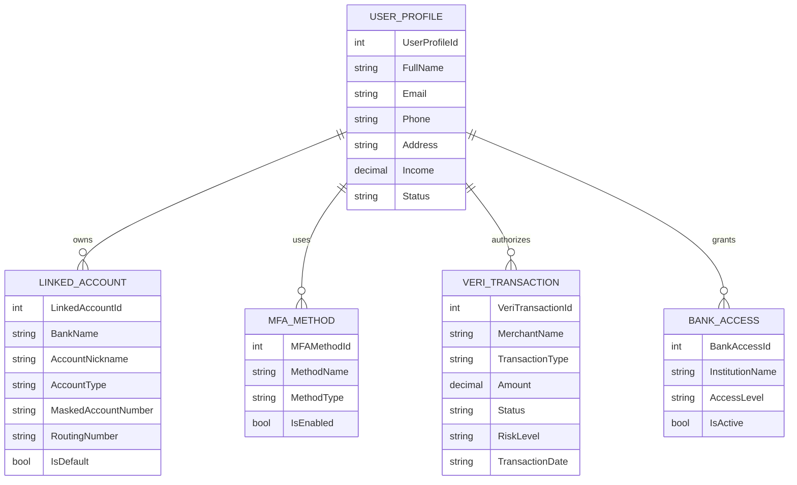

# VeriEye

VeriEye is an ASP.NET Core MVC web application for AI-powered iris authentication, secure payments, and identity verification.

## API Endpoints Used

VeriEye integrates data sources relevant to fraud prevention and financial security for display and analytics purposes only.

### Current Data Sources

#### Fraud Insights Dataset
- `/wwwroot/data/ftcFraudInsights.json`

This local JSON endpoint stores fraud statistics inspired by public consumer fraud reporting data and is used to power the Fraud Insights dashboard.

#### Front-End Visualization Libraries
- Chart.js CDN
- `/wwwroot/js/fraud-insights.js`

These tools dynamically fetch and visualize fraud trends, scam categories, and risk metrics through interactive charts.

### Purpose of API/Data Integration

The connected data sources are used strictly for:

- Fetching fraud-related information
- Displaying analytics dashboards
- Supporting educational insights for users and institutions
- Demonstrating real-time risk intelligence concepts relevant to VeriEye

### Storage Policy

No API data is used for persistent storage, authentication records, or customer account data. Persistent application data is managed separately through MVC models and in-app data structures.

## Data Model / Updated ERD Diagram

## Overview of CRUD Implementation

VeriEye uses ASP.NET Core MVC to implement CRUD functionality across core customer portal features. CRUD stands for Create, Read, Update, and Delete, allowing users to manage identity, banking, authentication, and profile data through dynamic web pages.

The VeriEye Customer Portal centralizes all account management tools in one secure dashboard.

---

## 1. VeriIdentity Profile CRUD

The VeriIdentity module allows users to manage their personal identity and KYC profile.

Implemented functionality:

- Create a VeriIdentity profile
- View profile information
- Edit name, email, phone, address, income, and verification details
- Delete profile records

Files used:

- `Models/UserProfile.cs`
- `Controllers/ProfileController.cs`
- `Views/Profile/Index.cshtml`
- `Views/Profile/Create.cshtml`
- `Views/Profile/Edit.cshtml`
- `Views/Profile/Delete.cshtml`

---

## 2. Linked Accounts CRUD

Users can manage connected checking, savings, and payment accounts.

Implemented functionality:

- Add linked bank accounts
- View all linked accounts
- Edit bank name, nickname, account type, masked account number, routing number, and default account
- Delete linked accounts

Files used:

- `Models/LinkedAccount.cs`
- `Controllers/LinkedAccountsController.cs`
- `Views/LinkedAccounts/Index.cshtml`
- `Views/LinkedAccounts/Create.cshtml`
- `Views/LinkedAccounts/Edit.cshtml`
- `Views/LinkedAccounts/Delete.cshtml`

---

## 3. MFA Settings CRUD

The Multi-Factor Authentication module allows users to manage login security settings.

Implemented functionality:

- Add new MFA methods
- View enabled methods
- Edit authentication preferences
- Delete MFA methods

Files used:

- `Models/MFAMethod.cs`
- `Controllers/MFAController.cs`
- `Views/MFA/Index.cshtml`
- `Views/MFA/Create.cshtml`
- `Views/MFA/Edit.cshtml`
- `Views/MFA/Delete.cshtml`

---

## 4. VeriTransactions Read Module

Users can monitor secure authentication activity and payment history.

Implemented functionality:

- View transaction history
- Review approval status
- Monitor fraud risk level
- Review flagged transfers

Files used:

- `Models/VeriTransaction.cs`
- `Controllers/CustomersController.cs`
- `Views/Customers/Transactions.cshtml`

---

## 5. Dashboard Data Display

The Customer Portal dashboard dynamically displays:

- Identity verification status
- Default linked account
- Risk level
- Last login
- Verified devices
- Pending reviews
- Bank access permissions

Files used:

- `Controllers/CustomersController.cs`
- `Views/Customers/Dashboard.cshtml`

---

## How Data Updates Across the Application

When users create, edit, or delete records, controller actions update the application's in-memory data collections and immediately refresh the related portal pages.

Examples:

- Adding a linked account updates the Linked Accounts table
- Editing profile data updates VeriIdentity
- Updating MFA settings reflects in security modules
- Changes appear instantly after redirecting to Index pages

---

## Data Management Method Used

VeriEye currently uses in-memory singleton-style lists for prototype persistence during runtime. This satisfies dynamic CRUD requirements without requiring a full SQL database.

This architecture can be upgraded in future versions to:

- Azure SQL Database
- Entity Framework Core
- Secure cloud persistence
- Real customer authentication systems

## Notable Technical Challenges and Solutions

Throughout the development of VeriEye, the team encountered several technical challenges while transforming the concept into a dynamic ASP.NET Core MVC web application. Each team member contributed to solving key areas of the project.

---

## 1. Converting a Static Concept into a Functional MVC Application

### Challenge:
The original VeriEye idea began as a static website concept. It needed to be transformed into a fully functional MVC web application with dynamic pages, controllers, models, and reusable views.

### Solution:

**Victorita Romanov** led the product vision and application structure by defining the user experience, portal features, and overall fintech use cases.

**Gavrie Grant** helped organize the MVC architecture by separating controllers, models, and views to ensure scalability and maintainability.

**Dina Belafqih** redesigned front-end layouts to make the application visually professional and user-friendly.

---

## 2. Building Dynamic CRUD Functionality

### Challenge:
The assignment required real Create, Read, Update, and Delete functionality across multiple entities rather than static HTML pages.

### Solution:

The team implemented CRUD modules for:

- VeriIdentity Profiles
- Linked Accounts
- MFA Settings

**Gavrie Grant** focused on backend controller logic and routing.

**Victorita Romanov** identified the most relevant banking use cases for each CRUD module.

**Dina Belafqih** improved the forms, tables, spacing, and user interaction design.

---

## 3. Maintaining Consistent UI / UX Across Pages

### Challenge:
As the application grew, multiple pages had inconsistent spacing, buttons, layouts, and styling.

### Solution:

**Dina Belafqih** led UI consistency improvements through shared CSS styling, card layouts, dashboard sections, and professional page structure.

The team used:

- Shared layout file (`_Layout.cshtml`)
- Global styling (`site.css`)
- Reusable card and panel components

---

## 4. Simulating Real FinTech Features Without Live Banking Systems

### Challenge:
Real banking APIs and biometric authentication systems are complex, expensive, and highly regulated.

### Solution:

The team created realistic prototype modules such as:

- VeriIdentity customer KYC profiles
- Linked account management
- VeriTransactions history
- Risk scoring dashboard
- Fraud Insights analytics

**Victorita Romanov** used real banking industry knowledge to design authentic use cases and workflows.

---

## 5. Integrating Fraud Data and Visual Analytics

### Challenge:
The website needed API/data integration relevant to VeriEye’s fraud prevention purpose.

### Solution:

The team integrated a fraud insights JSON data source and Chart.js visual dashboards.

**Gavrie Grant** handled data display logic.

**Dina Belafqih** improved chart placement and visual presentation.

**Victorita Romanov** aligned the analytics with fraud prevention and banking security themes.

---

## 6. Balancing Technical Requirements with Startup Branding

### Challenge:
The project needed to satisfy academic coding requirements while also feeling like a real fintech startup.

### Solution:

The team built VeriEye as both:

- A working MVC application
- A startup-ready biometric fintech concept

This included:

- Branding
- Customer portal design
- Merchant solutions pages
- Financial institution solutions pages
- About Us team page

---

## Final Team Contribution Summary

### Victorita Romanov
Founder / Product Strategy / FinTech Research / Banking Use Cases

### Dina Belafqih
UI/UX Design / Front-End Styling / User Experience

### Gavrie Grant
Back-End Development / MVC Controllers / Application Logic
